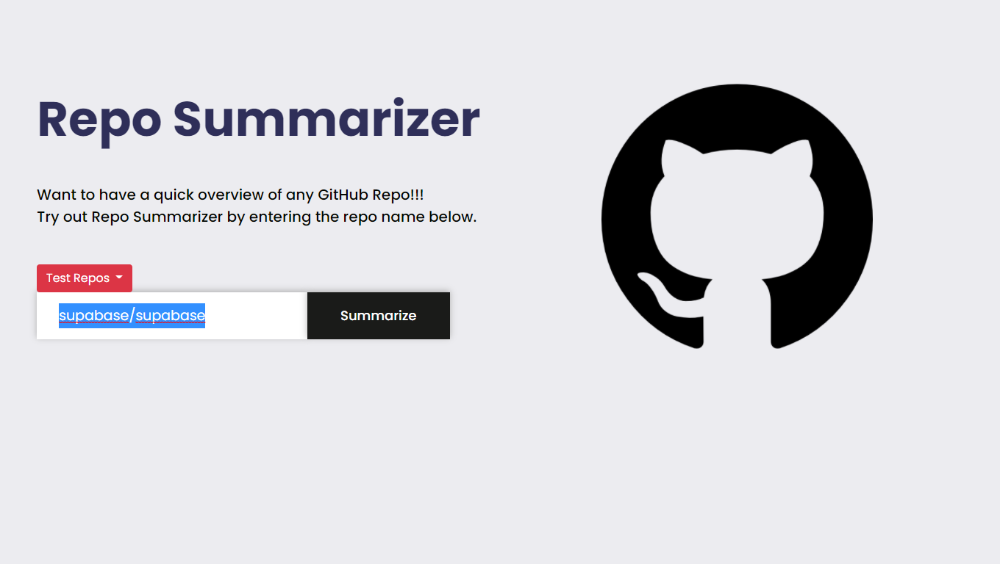
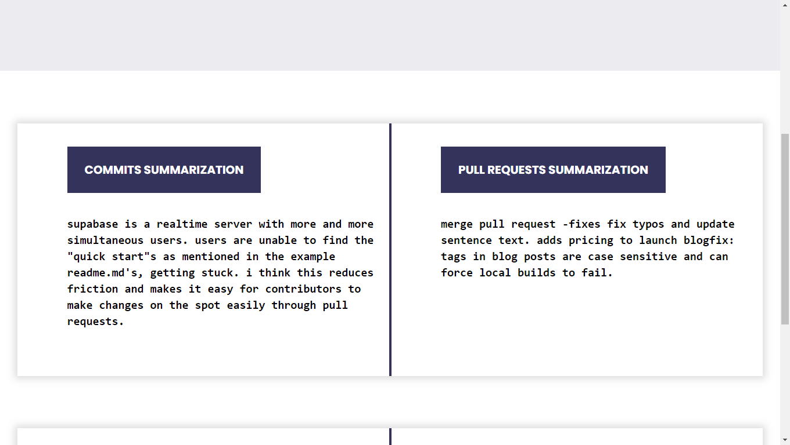
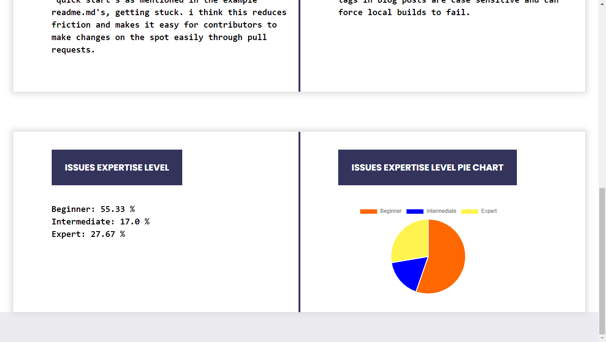

# RepoSummarizer
## About:
RepoSummarizer is a tool that outputs a summary of a Github repo using commits, pull requests and issues.
## Repo Summary Output :
* Commits Summary
* Pull Requests Summary
* Issues Expertise Level 
* Pie Chart of Issues Expertise Level
## Requirements and Setup:
```console
# clone the repository 
git clone https://github.com/NNNRedrock/RepoSummarizer.git

# cd into the project directory
cd RepoSummarizer/

# install packages required to run the tool
pipenv install

# to use the virtual env
pipenv shell
```
## How to Run:
After the setup process goto WebApp directory
```console
cd src/WebApp/Summarizer
```
Now run the following command
```console
python manage.py runserver
```
Open the URL shown in the terminal. <br/>
You can select any test repo or manually enter any repo name and click on Summarize button.<br/>
Test Repo 1:kamranahmedse/developer-roadmap<br/>
Test Repo 2:supabase/supabase <br/>
Test Repo 3:onnx/onnx <br/>
Test Repo 4:vectorizedio/redpanda <br/>
Test Repo 5:bazelbuild/bazel <br/>


## Screenshots of sample output:
### Home Page:

### Output:



